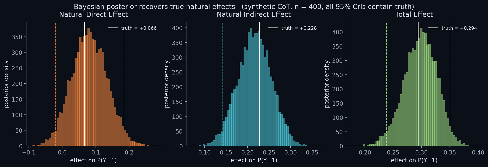

# bayes-cot-faithfulness

> **Bayesian causal mediation analysis for measuring whether LLM chain-of-thought reasoning actually drives its answers.** Calibrated uncertainty for scalable oversight and deception detection.

[](https://github.com/thylinao1/bayes-cot-faithfulness/actions/workflows/ci.yml)
[](LICENSE)
[](https://www.python.org/downloads/)

---

## The problem

Frontier LLMs increasingly produce chain-of-thought (CoT) reasoning that humans rely on to oversee them. But existing work has shown CoT can be *unfaithful* — decorative rather than causally connected to the answer:

- **Lanham et al. (2023):** truncating CoT often doesn't change the answer
- **Turpin et al. (2023):** biased CoT prompts produce biased answers without the bias appearing in the CoT
- **Anthropic CoT-monitorability research (2024–2025):** faithfulness depends sensitively on prompting and task type

Current measurements give noisy point estimates. **We cannot say with calibrated confidence whether one model is more faithful than another, or how much weight to give a faithfulness claim before deploying a model in a high-stakes setting.**

## What this project does

Imports 25 years of causal-mediation analysis from epidemiology and econometrics into LLM interpretability. CoT is treated formally as a mediator between the prompt and the answer, and we decompose the prompt's effect on the answer into:

- **Natural direct effect (NDE)** — the path that bypasses CoT
- **Natural indirect effect (NIE)** — the path that flows through CoT

Estimation is hierarchical Bayesian (PyMC), pooling information across prompts and seeds. Output is a posterior distribution — not a point estimate — over how much each CoT segment causally drives the final answer.

```
Prompt X  ─────────[α: direct]─────────►  Answer Y
   │                                          ▲
   │                                          │
   └──[γ: X→M]──►  CoT M  ──[β: M→Y]─────────┘
                                              
   NDE = effect of X on Y, holding M at M(X=0)
   NIE = effect on Y from M shifting due to X
   TE  = NDE + NIE   (under no-confounding assumptions)
```

## Current status

This repo contains a **synthetic-CoT validation pilot** that:

1. Generates synthetic traces with known ground-truth NDE and NIE
2. Fits a hierarchical Bayesian mediation model in PyMC
3. Recovers the true effects within 95% credible intervals
4. All runs on a laptop CPU in under a minute — no API calls, no GPU

This is the **methodological gate** before scaling to real LLM experiments. If the estimator can't recover known effects on controlled data, it won't recover them on real CoT.

The full project (Rapid Grant scope) extends this to:
- Real LLM experiments using truncation, paraphrase, and segment-swap interventions
- Cross-lab comparison (Claude / GPT / Llama / Gemma)
- A reusable benchmark with uncertainty-quantified faithfulness scores

## Quickstart

```bash
git clone https://github.com/thylinao1/bayes-cot-faithfulness
cd bayes-cot-faithfulness
pip install -e ".[dev]"
pytest                                          # 20 tests, ~10s
python notebooks/01_synthetic_validation.py     # runs the pilot end-to-end
```



Actual output (from `python notebooks/01_synthetic_validation.py`, CPU only, ~5s):

```
[1/4] Simulating synthetic CoT traces (n=400, seed=42)
        X balance: 0.495    Y rate: 0.650
        E[M|X=1] - E[M|X=0]: +0.834

[2/4] Computing ground-truth natural effects via Monte Carlo
        True NDE = +0.0662
        True NIE = +0.2277
        True TE  = +0.2939

[3/4] Fitting Bayesian mediation model in PyMC
        Sampling 4 chains for 1500 tune and 1500 draw iterations took 1s.
        alpha posterior mean = +0.368  (true +0.300)
        beta  posterior mean = +1.484  (true +1.500)
        gamma posterior mean = +0.791  (true +0.800)
        sigma posterior mean = +0.510  (true +0.500)

[4/4] Posterior recovery on the probability scale
        NDE posterior:  +0.081  [95% CrI: -0.019, +0.184]   contains truth: True
        NIE posterior:  +0.216  [95% CrI: +0.140, +0.291]   contains truth: True
        TE  posterior:  +0.298  [95% CrI: +0.238, +0.350]   contains truth: True

        coverage check passed.
        methodological gate cleared. ready to scale to real LLM experiments.
```

## Methodology

See [`docs/methodology.md`](docs/methodology.md) for the formal write-up:
- Natural-direct / natural-indirect effect decomposition
- Hierarchical Bayesian estimator
- Identification assumptions and what breaks when they're violated
- Connection to causal scrubbing and activation patching

## Roadmap (Rapid Grant scope)

- [x] Synthetic-CoT validation pilot (this repo)
- [ ] Real-LLM intervention harness (truncation, paraphrase, swap)
- [ ] Open-source-model sweep (Llama-3-8B, Gemma-2-9B)
- [ ] Frontier-model sweep (Claude Sonnet, GPT-4-class) via API
- [ ] Public uncertainty-quantified faithfulness benchmark
- [ ] Technical writeup (NeurIPS / AAAI safety workshop)

## Citation

If you build on this work, please cite:

```bibtex
@misc{silchenko2026bayescot,
  author = {Silchenko, Maksim},
  title  = {Bayesian Causal Faithfulness Audits for Chain-of-Thought Reasoning},
  year   = {2026},
  howpublished = {\url{https://github.com/thylinao1/bayes-cot-faithfulness}}
}
```

## License

MIT — see [`LICENSE`](LICENSE).

## Contact

Maksim Silchenko · mthylinao@gmail.com · [portfolio](https://thylinao1.github.io/index.html)
